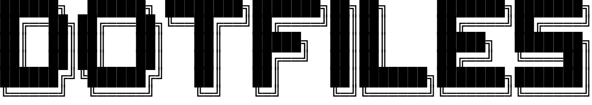

<br><br><br><br><br>
<a href="img/logo.txt"></a><br>
<br><br><br><br><br>

<p align="center">
    <a href="#installation"></a>
    <a href="LICENSE"></a>
    <a href="https://discord.gg/bF2GRHq"></a>
</p>

# dotfiles

**Many things will be changed in this repository, so use it at your own risk.**

## Screenshots

_Coming Soon_

## Included

- [Alacritty](https://github.com/alacritty/alacritty)
- [bspwm](https://github.com/baskerville/bspwm)
- [Neofetch](https://github.com/dylanaraps/neofetch)
- [Picom](https://github.com/yshui/picom)
- [Rofi](https://github.com/davatorium/rofi)
- [sxhkd](https://github.com/baskerville/sxhkd)
- [Zsh](https://www.zsh.org)

## Setup

## Simple

```bash
curl -L https://git.io/JOBCT | sh
```

### Manually

```bash
git clone https://github.com/PryosCode/dotfiles
cd dotfiles
chmod +x dotfiles
./dotfiles
```

## License

[Apache License 2.0](LICENSE)
